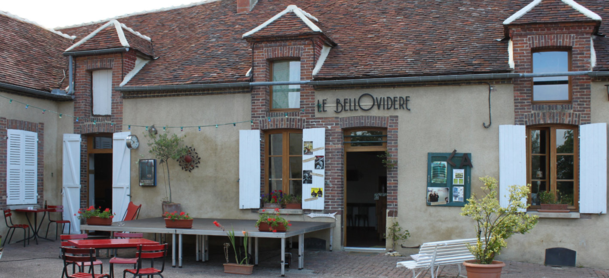
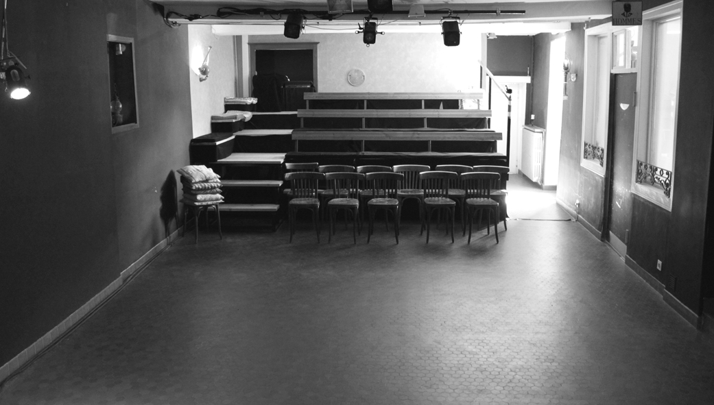

> Dans un théâtre, la salle de spectacle n’est qu’une pièce parmi d’autres...
> &mdash; <cite>Jean-Pierre Siméon</cite>

Venant de Paris, nous avons eu un coup de coeur pour cet ancien lieu de vie ouvert sur la place du village. Une place du village qui permettait d’être central... comme devraient toujours l’être l’art et la culture.

Cherchant un lieu de création, c’est avec enthousiasme que nous nous y sommes impliqués... comme si nous avions toujours été là, répondant à une véritable nécessité !

Grâce aux habitants des environs et à l’histoire du lieu, les évènements se sont enchaînés rapidement. Une grande partie du public, fort des souvenirs laissés sur place, nous pousse sans cesse vers de nouvelles aventures. C’est également grâce à leur « bouche à oreille », que de nouvelles personnes viennent grossir les rangs des habitués.

Volontairement installé ici-là, nous y défendons donc toute une conception de la vie : proche, culturelle, humaine, engagée et conviviale. 
Nous essayons de participer avec notre savoir faire artisanal (et nous revendiquons ce mot) à une vie forcément locale. Nous y programmons et nous y créons.

Pour s’ouvrir au monde sans s’éparpiller. Pour rayonner, pour faire vivre... par-ici-là.

Nous prenons le temps qui nous semble juste, nous avançons, nous cherchons en permanence... essayant toujours de nous-vous surprendre !

Charge à nous de continuer à développer nos actions avec la même exigence de qualité, sans perdre de vue la convivialité qui est une des forces du Bellovidère, un lieu de proximité à taille humaine...
